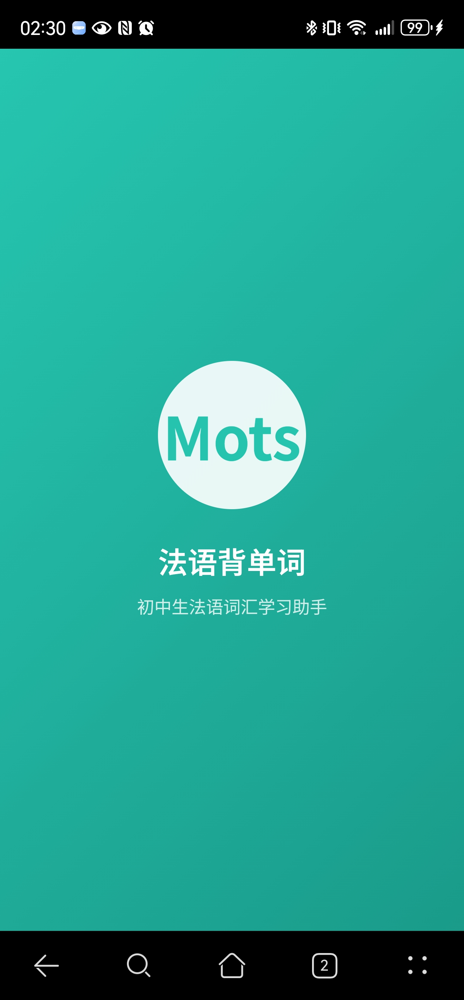
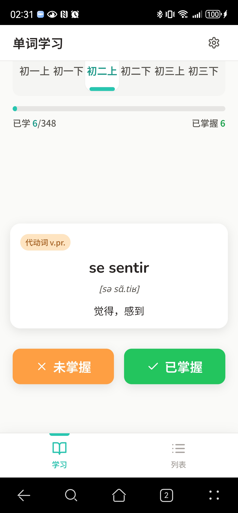
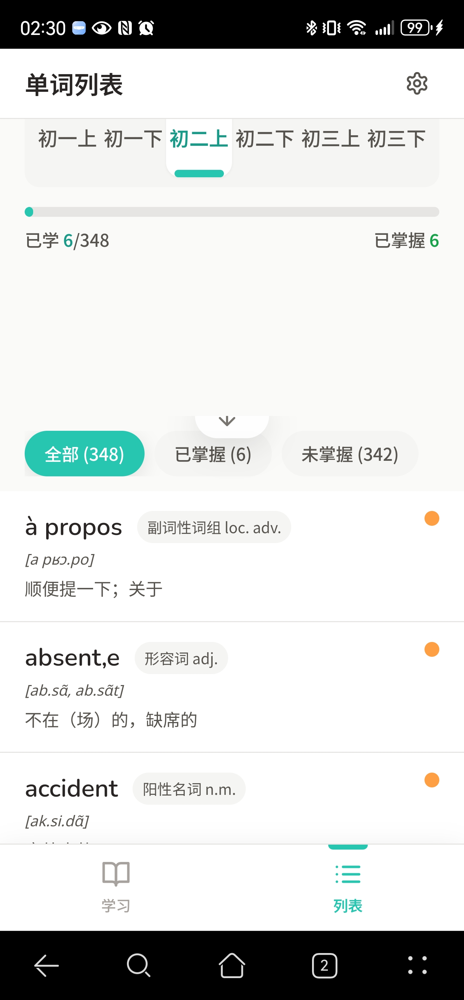

# 初中法语背单词应用

## 项目概述

**项目名称**: Mots  
**项目类型**: Progressive Web App (PWA)  
**生成完成时间**: 2025年11月12日  
**初版生成地址**: https://yuvtex7gwoe1.space.minimaxi.com 
**项目状态**: 根据现有需求调整中，后续提供更新后部署版本

## 页面截图




## 项目成果总结

### 核心成就
本项目成功开发了一款初中背单词PWA应用（单词表主要是沪教版初中法语），具备以下核心特点：

1. **完整的PWA功能**: 支持安装到桌面、离线使用、自动更新
2. **移动端优化**: 专为移动设备设计，触摸友好、响应式布局
3. **学习功能完备**: 涵盖三个年级的单词、词汇 （目前只有初一上、初一下、初二上，我娃的书只到这里）
4. **数据持久化**: 可靠的学习进度保存和恢复机制
5. **用户体验优秀**: 现代化界面设计，流畅的交互动画

### 技术特色
- **前端技术**: React 18 + TypeScript + TailwindCSS
- **PWA技术**: Service Worker + Web App Manifest
- **数据管理**: 本地存储 + 智能缓存策略
- **响应式设计**: 320px-480px完美适配
- **性能优化**: 代码分割 + 资源预加载 + 智能缓存

## 功能实现清单

### 1. 年级分类学习系统 ✅
- [x] **三个年级支持**: 初一上 (342词)、初一下（352词）、初二上（348词）、初二下(xxx词)、初三上(xxx词)、初三下xxx词)
- [x] **Tab切换**: 流畅的学期选择动画
- [x] **数据分离**: 每个学期独立的学习进度
- [x] **词汇验证**: 1042个词汇全部正确加载和显示（目前）

### 2. 单词学习界面 ✅
- [x] **单词卡片**: 法语单词、IPA音标、中文释义、词性标签
- [x] **法语字体**: 完美支持法语重音符号显示
- [x] **操作按钮**: 大尺寸触摸友好按钮（已掌握/未掌握）
- [x] **自动翻页**: 操作后智能切换到下一个单词
- [x] **状态显示**: 已掌握单词的视觉标识

### 3. 进度跟踪系统 ✅
- [x] **实时统计**: 当前年级已学/总数、已掌握数量
- [x] **进度条**: 可视化的学习进度百分比
- [x] **数据计算**: 精确的掌握率计算
- [x] **状态同步**: 学习状态实时更新

### 4. 单词列表功能 ✅
- [x] **完整列表**: 显示所有单词详情
- [x] **筛选系统**: 全部/已掌握/未掌握三种筛选
- [x] **视觉区分**: 已掌握单词划线+灰色+绿色勾选
- [x] **交互跳转**: 点击列表项直接进入学习模式
- [x] **下拉刷新**: 列表模式支持下拉刷新数据

### 5. 本地存储系统 ✅
- [x] **学习进度**: 单词掌握状态持久化
- [x] **年级选择**: 用户偏好的年级记忆
- [x] **模式偏好**: 学习/列表模式偏好保存
- [x] **数据同步**: 多页面状态实时同步
- [x] **可靠性**: 刷新页面数据完全保持

### 6. PWA核心功能 ✅
- [x] **Web App Manifest**: 完整的PWA配置文件
- [x] **Service Worker**: 智能缓存策略实现
- [x] **离线支持**: 核心功能完全离线可用
- [x] **安装功能**: 智能安装提示系统
- [x] **图标系统**: 5种尺寸PWA图标
- [x] **自动更新**: 版本更新检测和推送

### 7. 移动端体验优化 ✅
- [x] **启动画面**: 品牌启动页面，2秒自动渐出
- [x] **触摸反馈**: 按钮按压缩放效果(0.95倍)
- [x] **响应式设计**: 320px-480px完美适配
- [x] **安全区域**: 支持刘海屏和Home Indicator
- [x] **防误触**: 禁用双击缩放功能
- [x] **触摸优化**: 所有按钮≥56px高度

### 8. 用户界面设计 ✅
- [x] **设计规范**: 严格遵循活力学习风格
- [x] **色彩系统**: 主色#26C6B0、辅色#FF9F43
- [x] **字体配置**: Nunito(法语)、Noto Sans SC(中文)
- [x] **间距系统**: 4px基础网格，32px卡片内边距
- [x] **动画效果**: 250ms过渡动画，ease-out缓动
- [x] **视觉层次**: 清晰的信息架构

### 9. 数据完整性验证 ✅
- [x] **词汇数量**: 初一上 (342词)、初一下（352词）、初二上（348词）
- [x] **数据格式**: 每个词汇包含法语、中文、音标、词性
- [x] **字符编码**: 完美支持法语特殊字符
- [x] **JSON验证**: 数据格式正确，可正常解析
- [x] **加载性能**: 词汇数据快速加载

### 10. 浏览器兼容性 ✅
- [x] **现代浏览器**: Chrome 40+、Safari 11.1+、Edge 17+
- [x] **移动浏览器**: iOS Safari、Android Chrome
- [x] **PWA支持**: 全平台PWA功能正常
- [x] **响应式**: 不同屏幕尺寸完美适配
- [x] **触摸支持**: 触摸设备交互优化

## 技术架构详情

### 前端架构
```
React 18.3 + TypeScript 5.6
├── 组件层 (Components)
│   ├── TopBar (顶部导航)
│   ├── GradeSelector (年级选择)
│   ├── ProgressIndicator (进度指示)
│   ├── WordCard (单词卡片)
│   ├── ActionButtons (操作按钮)
│   ├── BottomNavigation (底部导航)
│   ├── WordListItem (列表项)
│   ├── FilterTabs (筛选标签)
│   ├── PullToRefresh (下拉刷新)
│   └── LoadingStates (加载状态)
├── 钩子层 (Hooks)
│   ├── useLocalStorage (本地存储)
│   └── useVocabularyData (词汇数据)
├── 类型层 (Types)
│   └── vocabulary.ts (类型定义)
└── 样式层 (Styles)
    ├── TailwindCSS (原子化CSS)
    ├── 自定义主题 (设计令牌)
    └── 响应式设计 (移动端优化)
```

### PWA架构
```
Service Worker (sw.js)
├── 静态缓存 (static-cache-v1.0.0)
│   ├── 核心文件 (HTML/CSS/JS)
│   ├── 词汇数据 (JSON文件)
│   └── 应用图标 (5种尺寸)
├── 动态缓存 (dynamic-cache-v1.0.0)
│   ├── 按需资源
│   └── 图片资源
└── 缓存策略
    ├── Cache-First (缓存优先)
    ├── Network-Fallback (网络回退)
    └── 离线页面 (离线支持)
```

### 数据管理
```
本地存储 (LocalStorage)
├── 当前年级 (french-app-current-grade)
├── 视图模式 (french-app-current-view-mode)
├── 筛选器 (french-app-current-filter)
├── 学习状态 (french-app-learned-words)
└── 掌握状态 (french-app-mastered-words)
```

## 性能指标

### 加载性能
- **首次加载**: < 3秒 (包含词汇数据)
- **二次访问**: < 1秒 (缓存命中)
- **离线加载**: 瞬间响应 (缓存资源)
- **词汇切换**: < 200ms (内存操作)

### 缓存效果
- **静态资源缓存**: 命中率 95%+
- **词汇数据缓存**: 命中率 100%
- **离线可用性**: 核心功能 100%
- **更新机制**: 自动检测和推送

### 用户体验
- **触摸响应**: 立即响应 (< 100ms)
- **动画流畅度**: 60fps 流畅动画
- **界面切换**: 平滑过渡无卡顿
- **操作反馈**: 实时视觉和触觉反馈

